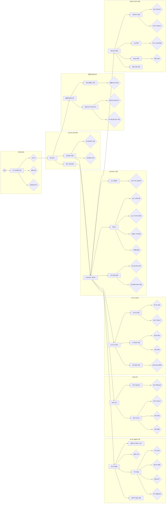

```mermaid
flowchart LR

  subgraph s1 ["인증/온보딩"]
    n1(("시작"))
    n2["로그인/회원가입"]
    n3{"로그인"}
    n4{"회원가입"}
    n5{"비밀번호 찾기"}
  end

  subgraph s2 ["대시보드/프로젝트"]
    n6["대시보드"]
    n7["프로젝트 목록"]
    n8{"새 프로젝트 생성"}
    n9{"프로젝트 검색"}
    n10["최근 작업 목록"]
  end

  subgraph s3 ["스토리보드 편집"]
    n11["스토리보드 에디터"]
    n12["요소 팔레트"]
    n13{"드래그 앤 드롭 배치"}
    n14["캔버스"]
    n15{"요소 선택/이동"}
    n16{"요소 리사이즈/회전"}
    n17{"연결선 추가/편집"}
    n18{"그룹화/정렬"}
    n19["속성 편집 패널"]
    n20{"텍스트/대사 입력"}
    n21{"조건/메타데이터 편집"}
  end

  subgraph s4 ["실시간 협업/피드백"]
    n22["실시간 협업"]
    n23["협업자 프레즌스 표시"]
    n24{"팀원 초대"}
    n25["주석 패널"]
    n26{"주석 생성"}
    n27{"멘션 및 알림"}
    n28{"답글 달기"}
    n29{"주석 해결/보관"}
    n30["권한 및 잠금 설정"]
  end

  subgraph s5 ["버전 관리"]
    n31["버전 관리"]
    n32["버전 타임라인"]
    n33{"버전 목록 탐색"}
    n34["버전 비교 뷰"]
    n35{"버전 미리보기"}
    n36{"버전 복원"}
    n37{"버전 병합"}
  end

  subgraph s6 ["템플릿/컴포넌트"]
    n38["템플릿/컴포넌트"]
    n39["장르 템플릿 선택"]
    n40{"템플릿으로 생성"}
    n41["컴포넌트 라이브러리"]
    n42{"컴포넌트 불러오기"}
    n43{"커스텀 컴포넌트 저장"}
  end

  subgraph s7 ["AI 어시스턴트"]
    n44["AI 어시스턴트"]
    n45["AI 초안 생성"]
    n46{"텍스트 입력"}
    n47{"초안 미리보기"}
    n48["AI 개선안 제안"]
    n49{"개선안 확인"}
    n50{"부분 적용"}
    n51["대사/문장 정리"]
    n52{"문장 생성/간결화"}
  end

  subgraph s8 ["내보내기/외부 연동"]
    n53["내보내기/연동"]
    n54["내보내기 설정"]
    n55{"PDF 내보내기"}
    n56{"이미지 내보내기"}
    n57["Jira 연동"]
    n58{"태스크 생성/연결"}
    n59["Slack 연동"]
    n60{"알림 설정"}
    n61["연동 인증 관리"]
  end

  n1 --> n2
  n2 --> n3
  n2 --> n4
  n2 --> n5
  n3 --> n6
  n6 --> n7
  n7 --> n8
  n7 --> n9
  n6 --> n10
  n7 --> n11
  n10 --> n11
  n11 --> n12
  n12 --> n13
  n11 --> n14
  n14 --> n15
  n14 --> n16
  n14 --> n17
  n14 --> n18
  n11 --> n19
  n19 --> n20
  n19 --> n21
  n11 --> n22
  n22 --> n23
  n22 --> n24
  n22 --> n25
  n25 --> n26
  n25 --> n27
  n25 --> n28
  n25 --> n29
  n22 --> n30
  n11 --> n31
  n31 --> n32
  n32 --> n33
  n31 --> n34
  n34 --> n35
  n34 --> n36
  n34 --> n37
  n6 --> n38
  n38 --> n39
  n39 --> n40
  n38 --> n41
  n41 --> n42
  n41 --> n43
  n11 --> n44
  n44 --> n45
  n45 --> n46
  n45 --> n47
  n44 --> n48
  n48 --> n49
  n48 --> n50
  n44 --> n51
  n51 --> n52
  n11 --> n53
  n53 --> n54
  n54 --> n55
  n54 --> n56
  n53 --> n57
  n57 --> n58
  n53 --> n59
  n59 --> n60
  n53 --> n61
```
